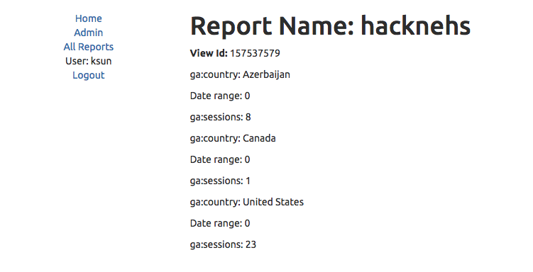
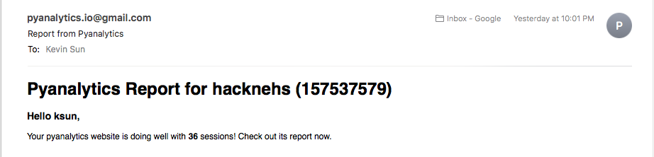

# pyanalytics
Python analytics library that analyzes data on your websites and provides recommendations. Built on Google Analytics API. :chart_with_upwards_trend::chart_with_downwards_trend::rocket:

**pyanalytics is currently in early development stage.**

# Getting Started

## Installation
1. Enable the Google Analytics API using the [setup tool](https://console.developers.google.com/start/api?id=analyticsreporting.googleapis.com&credential=client_key), which guides you through creating a project in the Google API Console, enabling the API, and creating credentials. Download `client_secrets.json` in the base level of the Django app
2. Create a [service account](https://console.developers.google.com/permissions/serviceaccounts) and download a JSON private key called `service_account.json` in the base level of the Django app
3. Add your service account email to the Google Analytics view you want to access via the API
4. Setup virtual environment and install dependencies from `requirements.txt`
5. Setup the Django app

## Quick Demos

---

Be sure to follow the [contribution guidelines](CONTRIBUTING.md) when submitting code. Always abide by the [code of conduct](CODE_OF_CONDUCT.md).
